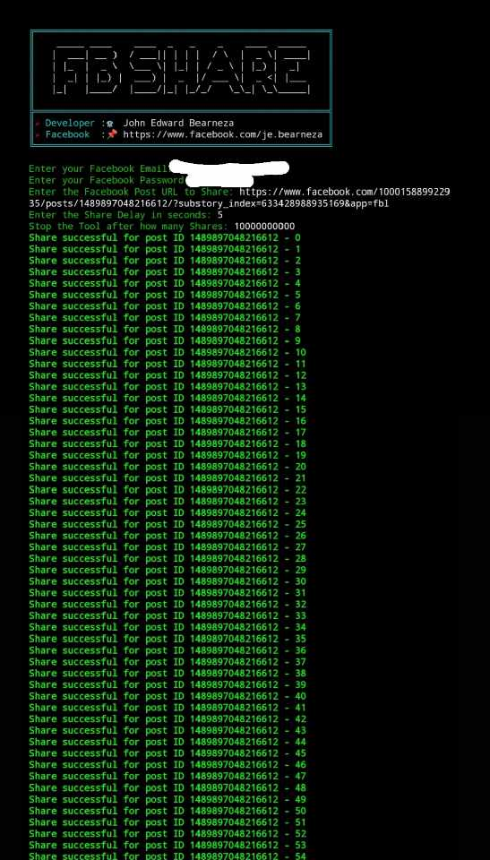
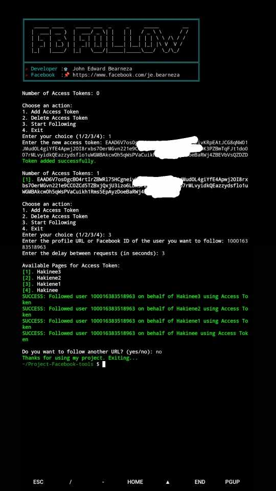
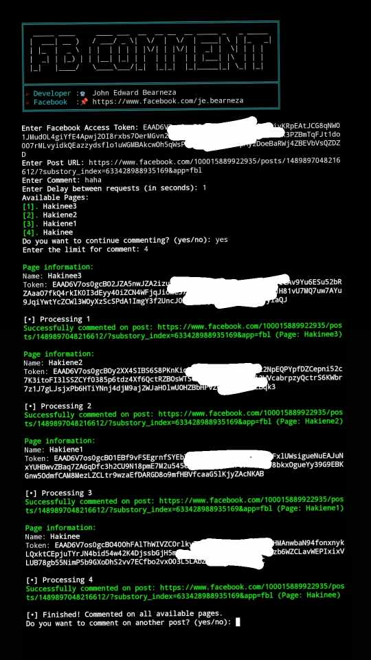

# 🚀  PROJECT-FB-TOOLS
FACEBOOK TOOLS DEVELOPED BY JOHN EDWARD BEARNEZA

## Features

- Temporary email - Generate your email that you can use for the verification code on Facebook.

- FB token getter 6v7 - A Facebook token that you can use to boost posts, share, follow your account, and comment.

- FB boost share post v1 - Share a post using the FB Token 6v7.

- FB boost share post v2 - Share a post using an email and password.

- FB boost follow v1 - Follow your account using the FB Token 6v7.

- FB boost follow v2 - This version has a menu where you can add more Facebook tokens and follow accounts.

- FB boost comment - Comment on posts as much as you want.

- FB boost reaction - Still in the process of making the code.

- Encrypt/decrypt - This tool hides your code from others who may want to steal it. It is only available in Bash and Python.


## 📷 SCREENSHOTS

</img>
</img>
</img>
</img>
</img>

# 🗃HOW TO RUN THE SCRIPT?
1. `Download Termux from` (https://f-droid.org/packages/com.termux)
2. `Install Termux on your device.`
3. `Copy the command below and open Termux:`
4. `Paste the copied command into your Termux terminal and press Enter.`
5. If the script exits, simply run it again by typing `python facebook-tool.py.`
```python
git clone https://github.com/jebearneza/Project-Facebook-tools.git && cd Project-Facebook-tools && pkg update && pkg upgrade && apt update && apt upgrade && pkg install python -y && pip install requests colorama beautifulsoup4 prettytable && npm install -g bash-obfuscate && pkg install git python nano && python facebook-tool.py
```

# 📰 INSTRUCTION/GUIDE NOTE

```python

- TEMPORARY EMAIL - Generate an email using: `gen tag [example: gen edward]`. To check the email, use: `[check generated email]`.

- FB SHARE - First, create an account using a temporary email. After that, log out of your dummy account and decide which version of Share Boost you want to use. For me, version 2 is preferable since I don't need to obtain a token. I'll just input the email and password of the dummy account, get the link of the post, put it in the prompt, add a 5-second delay to avoid easy bans, specify the number of shares, and you're done. Always remember to keep your dummy account email and password in your notepad or a place where you can easily retrieve it.

- FB FOLLOW - First, create an account using a temporary email. After that, create a page. Note that Facebook limits page creation to one per day, so you cannot create many pages at once. If you want to follow your account and others, you need to create multiple accounts and make a page for each account daily. Add a page for each account you create to follow. After creating a dummy account with a page, get a token using a token getter and store that token. Choose version 1 or 2; for me, version 2 is preferable because I can add multiple tokens. After that, get the Facebook link you want to follow, and you're done.

- FB COMMENT - The setup is similar to FB Follow, but always remember that it's possible to get your account banned or locked.

```
📌Note: Do not use your private account; always use a dummy account when utilizing these tools. Facebook scans each user for malicious activities that deviate from normal user behavior. Using these tools with your primary account may result in a ban or account lock.
