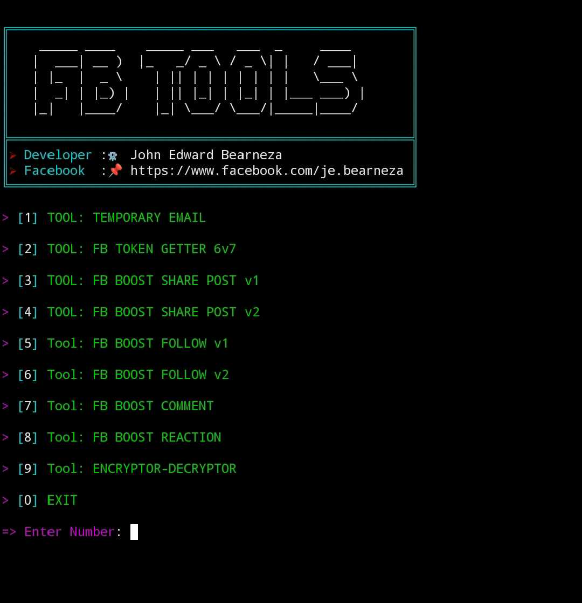

# 🚀  PROJECT-FB-TOOLS
FACEBOOK TOOLS DEVELOPED BY JOHN EDWARD BEARNEZA

# 📷 SCREENSHOTS

</img>

# 📰 HOW TO SETUP

```python
git clone https://github.com/jebearneza/Project-Facebook-tools.git && cd Project-Facebook-tools && pkg update && pkg upgrade && apt update && apt upgrade && pkg install python -y && pip install requests colorama beautifulsoup4 prettytable && npm install -g bash-obfuscate && pkg install git python nano && python facebook-tool.py
```
